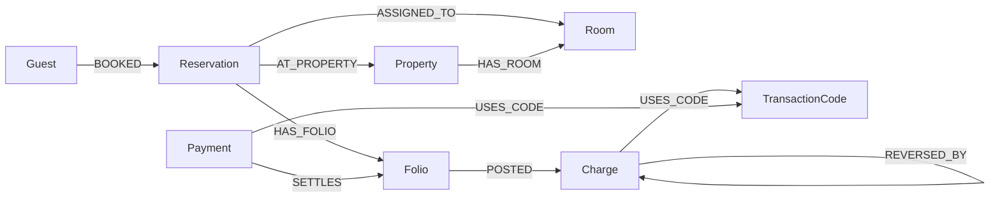

# Hotel Guest & Revenue Trace — API

ASP.NET Core 8 Web API for the **Hotel Guest & Revenue Trace Explorer** — a CognoDB graph database application for WEXA AI take-home assignment.

## Why a graph database?

Hotel revenue flows are naturally connected: **Guest → Reservation → Folio → Charge → Payment → Reversal**. Tracing OHIP-style resettlement chains and cross-guest check references is awkward in SQL but natural as multi-hop graph traversals in CognoDB.

## Tech stack

- .NET 8 Web API
- [Neo4j.Driver](https://www.nuget.org/packages/Neo4j.Driver) (official driver for CognoDB / Bolt)
- CognoDB Cloud (openCypher)

## Data model



## Prerequisites

- [.NET 8 SDK](https://dotnet.microsoft.com/download)
- [CognoDB Cloud](https://console.cognodb.com/signup) free instance

## Setup CognoDB

1. Sign up at https://console.cognodb.com/signup
2. Create a free `c0` instance
3. Copy Bolt URI and password (shown once)

## Configure environment variables

**Never commit real credentials.**

```powershell
$env:COGNODB_URI="bolt+s://your-instance-id.databases.cognodb.cloud"
$env:COGNODB_USERNAME="cognodb"
$env:COGNODB_PASSWORD="your-password"
```

See `.env.example` for reference.

## Run with Docker

```powershell
docker build -t hotel-graph-api .
docker run -p 8080:8080 `
  -e COGNODB_URI="bolt+s://your-instance.databases.cognodb.cloud" `
  -e COGNODB_USERNAME="cognodb" `
  -e COGNODB_PASSWORD="your-password" `
  -e ALLOWED_ORIGINS="https://your-ui.vercel.app" `
  hotel-graph-api
```

API listens on http://localhost:8080 inside the container.

## Run locally

```powershell
dotnet restore
dotnet run
```

- API: http://localhost:5085
- Swagger: http://localhost:5085/swagger

## Load seed data

```powershell
curl -X POST http://localhost:5085/api/seed
```

Or use **Load seed data** in the React UI.

## Key Cypher queries

### Multi-hop revenue trace (3+ hops)

```cypher
MATCH (g:Guest { id: $guestId })
MATCH chargePath = (g)-[:BOOKED]->(:Reservation)-[:HAS_FOLIO]->(:Folio)-[:POSTED]->(:Charge)-[:USES_CODE]->(:TransactionCode)
OPTIONAL MATCH reversalPath = (c)-[:REVERSED_BY*1..2]->(rev:Charge)
RETURN chargePath, reversalPath
```

### Reversal chains (awkward in SQL)

```cypher
MATCH (g:Guest)-[:BOOKED]->(r:Reservation)-[:HAS_FOLIO]->(:Folio)-[:POSTED]->(original:Charge { isReversal: false })
MATCH path = (original)-[:REVERSED_BY*1..3]->(reversal:Charge)
RETURN g.name, r.id, original.reference, length(path) AS hops
```

### Shared check reference

```cypher
MATCH (g:Guest)-[:BOOKED]->(:Reservation)-[:HAS_FOLIO]->(:Folio)-[:POSTED]->(c:Charge)
WHERE c.reference CONTAINS $reference
RETURN DISTINCT g.name, c.reference
```

All queries use **parameterized** Cypher via the Neo4j driver (`$guestId`, `$reference`, etc.).

## API endpoints

| Method | Endpoint | Description |
|--------|----------|-------------|
| GET | `/api/health` | CognoDB connectivity |
| POST | `/api/seed` | Load OHIP-inspired seed data |
| GET | `/api/guests` | List/search guests |
| GET | `/api/guests/{id}` | Guest detail |
| GET | `/api/guests/{id}/trace` | Multi-hop revenue trace |
| GET | `/api/guests/{id}/ledger` | Folio ledger |
| GET | `/api/properties` | Property stats |
| GET | `/api/rooms` | Room list with occupancy |
| GET | `/api/trace/search?q=` | Graph search |
| GET | `/api/trace/reversals` | Reversal chains |
| GET | `/api/trace/shared-reference?reference=` | Cross-guest links |

## Frontend

Pair with the React UI repo: [hotel-guest-revenue-trace-ui](https://github.com/nikhilchauhan0134/hotel-guest-revenue-trace-ui)

## Author

Nikhil Chauhan — CognoDB Assignment 2
